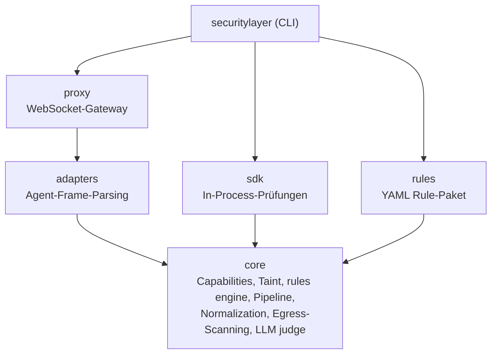
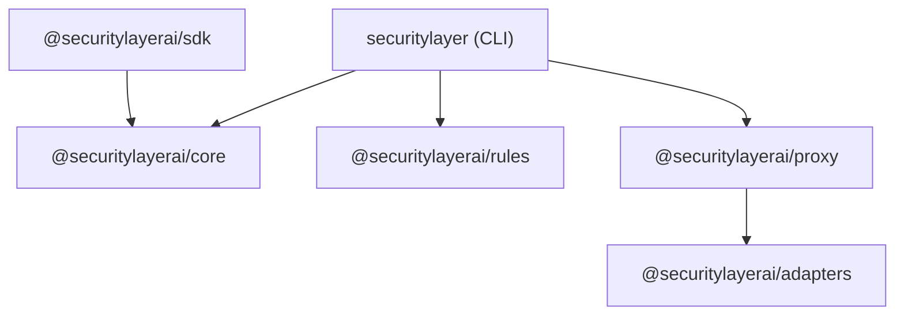

Security Layer ist ein Bun-Monorepo mit sechs Paketen. Jedes Paket hat eine einzige Verantwortung und klar definierte Grenzen.

## Architektur



## Paketübersicht

| Paket | npm | Beschreibung |
|---|---|---|
| [`@securitylayerai/core`](/docs/packages/core) | `@securitylayerai/core` | Security engine — capabilities, Taint, rules, Pipeline, normalization |
| [`@securitylayerai/rules`](/docs/packages/rules) | `@securitylayerai/rules` | Baseline rules und capability templates (YAML) |
| [`@securitylayerai/adapters`](/docs/packages/adapters) | `@securitylayerai/adapters` | Agentenprotokoll-Adapter (OpenClaw, generisch) |
| [`@securitylayerai/proxy`](/docs/packages/proxy) | `@securitylayerai/proxy` | WebSocket-Sicherheitsproxy zwischen Clients und Agent-Gateway |
| [`@securitylayerai/sdk`](/docs/sdk) | `@securitylayerai/sdk` | TypeScript-SDK für In-Process-Sicherheitsprüfungen |
| `securitylayer` | `securitylayer` | CLI — benutzerorientierte Befehle, Setup, Hooks |

## Abhängigkeitsgraph



Zentrale Einschränkungen:
- **core** hat null interne Abhängigkeiten — es ist das Fundament
- **rules** ist rein datenbasiert — YAML-Dateien mit einem schlanken Loader, keine Laufzeitabhängigkeit von core
- **adapters** ist eigenständig — definiert das Interface und Implementierungen für Agentenprotokolle
- **proxy** hängt von adapters für das Frame-Parsing ab
- **sdk** hängt von core für die security pipeline ab

## Entwicklung

```bash
# Alle Abhängigkeiten installieren
bun install

# Alle Tests ausführen
bun run test

# Tests für ein bestimmtes Paket ausführen
bun run test --filter=@securitylayerai/core

# Alles auf Typen prüfen
bun run typecheck
```

<Cards>
  <Card
    title="Core"
    description="Security engine, Pipeline, capabilities, Taint-Tracking."
    href="/docs/packages/core"
    icon={<Shield weight="duotone" />}
  />
  <Card
    title="Rules"
    description="Baseline rules und capability templates."
    href="/docs/packages/rules"
    icon={<Gear weight="duotone" />}
  />
  <Card
    title="Adapters"
    description="Agentenprotokoll-Adapter für Frame-Parsing."
    href="/docs/packages/adapters"
    icon={<Plug weight="duotone" />}
  />
  <Card
    title="Proxy"
    description="WebSocket-Sicherheitsproxy für Agent-Gateways."
    href="/docs/packages/proxy"
    icon={<Globe weight="duotone" />}
  />
  <Card
    title="SDK"
    description="TypeScript-SDK für In-Process-Sicherheitsprüfungen."
    href="/docs/packages/sdk"
    icon={<Package weight="duotone" />}
  />
</Cards>
