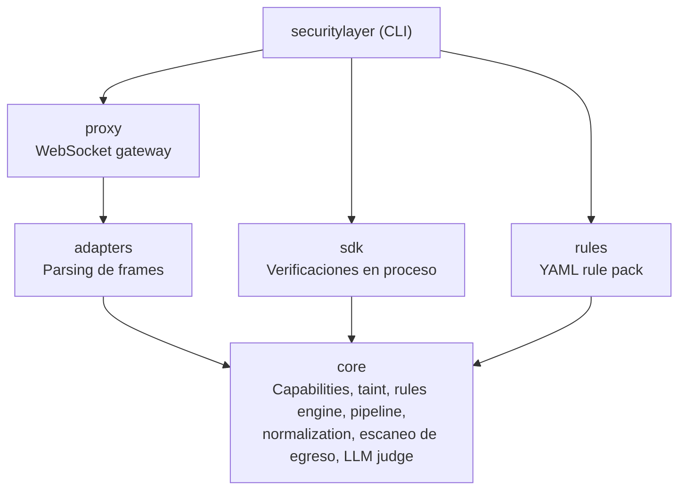
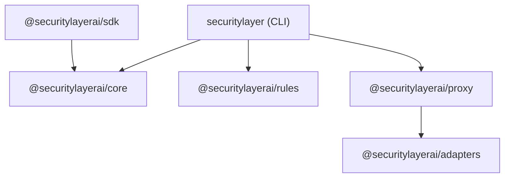

Security Layer es un monorepo de Bun con seis paquetes. Cada paquete tiene una responsabilidad nica y lmites bien definidos.

## Arquitectura



## Resumen de paquetes

| Paquete | npm | Descripcin |
|---|---|---|
| [`@securitylayerai/core`](/docs/packages/core) | `@securitylayerai/core` | Security engine -- capabilities, taint, rules, pipeline, normalization |
| [`@securitylayerai/rules`](/docs/packages/rules) | `@securitylayerai/rules` | Baseline rules y capability templates (YAML) |
| [`@securitylayerai/adapters`](/docs/packages/adapters) | `@securitylayerai/adapters` | Adaptadores de protocolos de agentes (OpenClaw, genrico) |
| [`@securitylayerai/proxy`](/docs/packages/proxy) | `@securitylayerai/proxy` | Proxy de seguridad WebSocket entre clientes y gateway de agentes |
| [`@securitylayerai/sdk`](/docs/sdk) | `@securitylayerai/sdk` | SDK de TypeScript para verificaciones de seguridad en proceso |
| `securitylayer` | `securitylayer` | CLI -- comandos de usuario, setup, hooks |

## Grafo de dependencias



Restricciones clave:
- **core** tiene cero dependencias internas -- es la base
- **rules** es solo datos -- archivos YAML con un loader ligero, sin dependencia de core en tiempo de ejecucin
- **adapters** es independiente -- define la interfaz e implementaciones para protocolos de agentes
- **proxy** depende de adapters para el parsing de frames
- **sdk** depende de core para el security pipeline

## Desarrollo

```bash
# Instalar todas las dependencias
bun install

# Ejecutar todos los tests
bun run test

# Ejecutar tests de un paquete especfico
bun run test --filter=@securitylayerai/core

# Verificar tipos en todo el proyecto
bun run typecheck
```

<Cards>
  <Card
    title="Core"
    description="Security engine, pipeline, capabilities, seguimiento de taint."
    href="/docs/packages/core"
    icon={<Shield weight="duotone" />}
  />
  <Card
    title="Rules"
    description="Baseline rules y capability templates."
    href="/docs/packages/rules"
    icon={<Gear weight="duotone" />}
  />
  <Card
    title="Adapters"
    description="Adaptadores de protocolos de agentes para parsing de frames."
    href="/docs/packages/adapters"
    icon={<Plug weight="duotone" />}
  />
  <Card
    title="Proxy"
    description="Proxy de seguridad WebSocket para gateways de agentes."
    href="/docs/packages/proxy"
    icon={<Globe weight="duotone" />}
  />
  <Card
    title="SDK"
    description="SDK de TypeScript para verificaciones de seguridad en proceso."
    href="/docs/packages/sdk"
    icon={<Package weight="duotone" />}
  />
</Cards>
