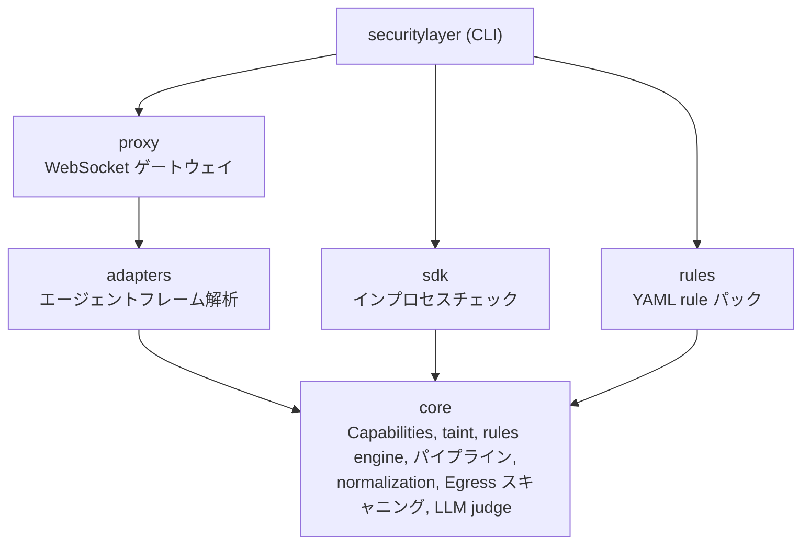
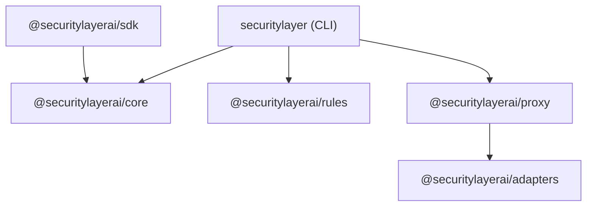

Security Layer は 6 つのパッケージを持つ Bun モノレポです。各パッケージは単一の責務と明確な境界を持ちます。

## アーキテクチャ



## パッケージ概要

| パッケージ | npm | 説明 |
|---|---|---|
| [`@securitylayerai/core`](/docs/packages/core) | `@securitylayerai/core` | security engine — capabilities、taint、rules、パイプライン、normalization |
| [`@securitylayerai/rules`](/docs/packages/rules) | `@securitylayerai/rules` | ベースライン rules と capability テンプレート（YAML） |
| [`@securitylayerai/adapters`](/docs/packages/adapters) | `@securitylayerai/adapters` | エージェントプロトコルアダプター（OpenClaw、汎用） |
| [`@securitylayerai/proxy`](/docs/packages/proxy) | `@securitylayerai/proxy` | クライアントとエージェントゲートウェイ間の WebSocket セキュリティプロキシ |
| [`@securitylayerai/sdk`](/docs/sdk) | `@securitylayerai/sdk` | インプロセスセキュリティチェック用の TypeScript SDK |
| `securitylayer` | `securitylayer` | CLI — ユーザー向けコマンド、セットアップ、フック |

## 依存関係グラフ



主要な制約:
- **core** は内部依存ゼロ — 基盤となるパッケージ
- **rules** はデータのみ — YAML ファイルと薄いローダーで、ランタイムに core への依存なし
- **adapters** はスタンドアロン — エージェントプロトコルのインターフェースと実装を定義
- **proxy** はフレーム解析のために adapters に依存
- **sdk** は security pipeline のために core に依存

## 開発

```bash
# すべての依存関係をインストール
bun install

# すべてのテストを実行
bun run test

# 特定のパッケージのテストを実行
bun run test --filter=@securitylayerai/core

# すべてを型チェック
bun run typecheck
```

<Cards>
  <Card
    title="Core"
    description="security engine、パイプライン、capabilities、taint tracking。"
    href="/docs/packages/core"
    icon={<Shield weight="duotone" />}
  />
  <Card
    title="Rules"
    description="ベースライン rules と capability テンプレート。"
    href="/docs/packages/rules"
    icon={<Gear weight="duotone" />}
  />
  <Card
    title="Adapters"
    description="フレーム解析用のエージェントプロトコルアダプター。"
    href="/docs/packages/adapters"
    icon={<Plug weight="duotone" />}
  />
  <Card
    title="Proxy"
    description="エージェントゲートウェイ用の WebSocket セキュリティプロキシ。"
    href="/docs/packages/proxy"
    icon={<Globe weight="duotone" />}
  />
  <Card
    title="SDK"
    description="インプロセスセキュリティチェック用の TypeScript SDK。"
    href="/docs/packages/sdk"
    icon={<Package weight="duotone" />}
  />
</Cards>
