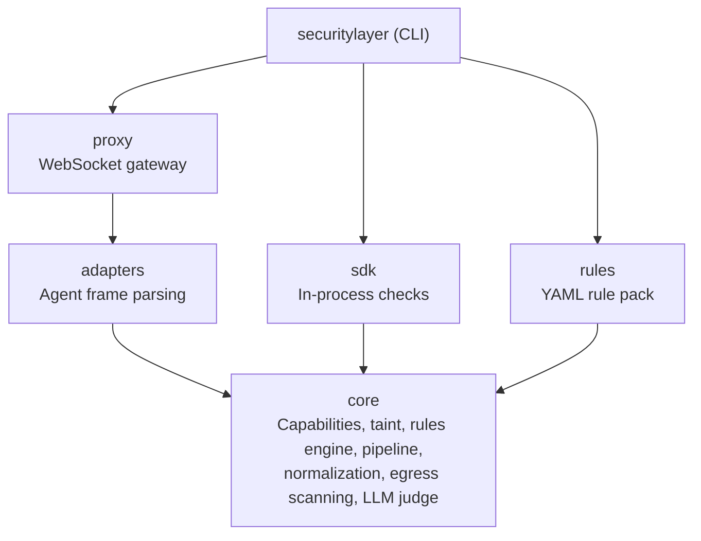
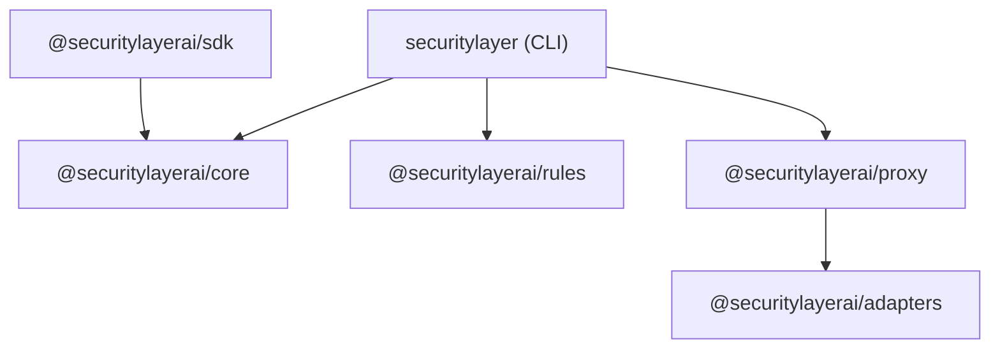

Security Layer is a Bun monorepo with six packages. Each package has a single responsibility and well-defined boundaries.

## Architecture



## Package overview

| Package | npm | Description |
|---|---|---|
| [`@securitylayerai/core`](/docs/packages/core) | `@securitylayerai/core` | Security engine — capabilities, taint, rules, pipeline, normalization |
| [`@securitylayerai/rules`](/docs/packages/rules) | `@securitylayerai/rules` | Baseline rules and capability templates (YAML) |
| [`@securitylayerai/adapters`](/docs/packages/adapters) | `@securitylayerai/adapters` | Agent protocol adapters (OpenClaw, generic) |
| [`@securitylayerai/proxy`](/docs/packages/proxy) | `@securitylayerai/proxy` | WebSocket security proxy between clients and agent gateway |
| [`@securitylayerai/sdk`](/docs/sdk) | `@securitylayerai/sdk` | TypeScript SDK for in-process security checks |
| `securitylayer` | `securitylayer` | CLI — user-facing commands, setup, hooks |

## Dependency graph



Key constraints:
- **core** has zero internal dependencies — it's the foundation
- **rules** is data-only — YAML files with a thin loader, no dependency on core at runtime
- **adapters** is standalone — defines the interface and implementations for agent protocols
- **proxy** depends on adapters for frame parsing
- **sdk** depends on core for the security pipeline

## Development

```bash
# Install all dependencies
bun install

# Run all tests
bun run test

# Run tests for a specific package
bun run test --filter=@securitylayerai/core

# Type-check everything
bun run typecheck
```

<Cards>
  <Card
    title="Core"
    description="Security engine, pipeline, capabilities, taint tracking."
    href="/docs/packages/core"
    icon={<Shield weight="duotone" />}
  />
  <Card
    title="Rules"
    description="Baseline rules and capability templates."
    href="/docs/packages/rules"
    icon={<Gear weight="duotone" />}
  />
  <Card
    title="Adapters"
    description="Agent protocol adapters for frame parsing."
    href="/docs/packages/adapters"
    icon={<Plug weight="duotone" />}
  />
  <Card
    title="Proxy"
    description="WebSocket security proxy for agent gateways."
    href="/docs/packages/proxy"
    icon={<Globe weight="duotone" />}
  />
  <Card
    title="SDK"
    description="TypeScript SDK for in-process security checks."
    href="/docs/packages/sdk"
    icon={<Package weight="duotone" />}
  />
</Cards>
