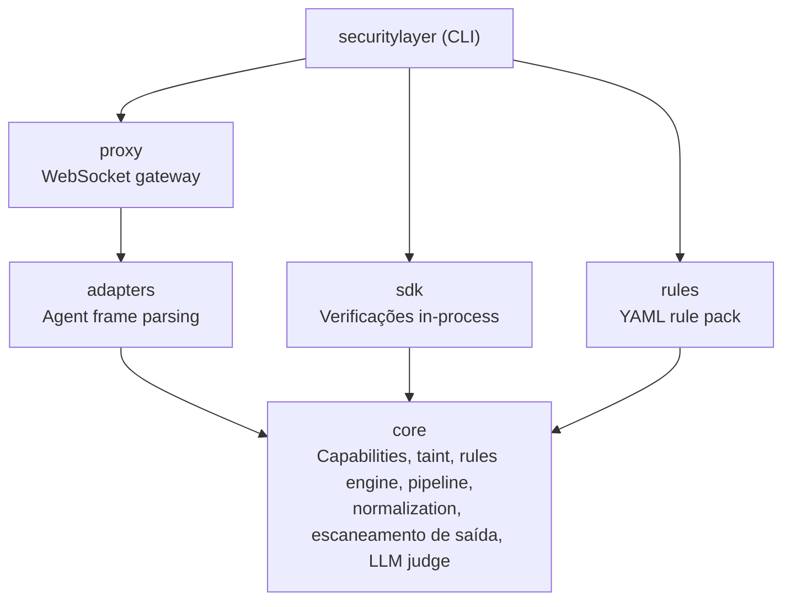
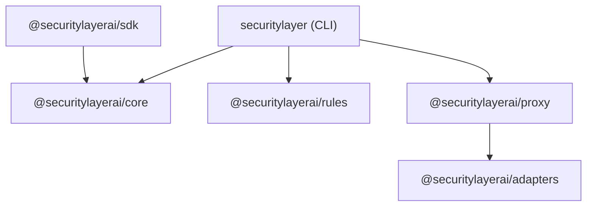

O Security Layer é um monorepo Bun com seis pacotes. Cada pacote tem uma responsabilidade única e fronteiras bem definidas.

## Arquitetura



## Visão geral dos pacotes

| Pacote | npm | Descrição |
|---|---|---|
| [`@securitylayerai/core`](/docs/packages/core) | `@securitylayerai/core` | Security engine — capabilities, taint, rules, pipeline, normalization |
| [`@securitylayerai/rules`](/docs/packages/rules) | `@securitylayerai/rules` | Rules base e templates de capabilities (YAML) |
| [`@securitylayerai/adapters`](/docs/packages/adapters) | `@securitylayerai/adapters` | Adaptadores de protocolo de agente (OpenClaw, genérico) |
| [`@securitylayerai/proxy`](/docs/packages/proxy) | `@securitylayerai/proxy` | Proxy de segurança WebSocket entre clientes e gateway do agente |
| [`@securitylayerai/sdk`](/docs/sdk) | `@securitylayerai/sdk` | SDK TypeScript para verificações de segurança in-process |
| `securitylayer` | `securitylayer` | CLI — comandos voltados ao usuário, setup, hooks |

## Grafo de dependências



Restrições principais:
- **core** não tem dependências internas — é a fundação
- **rules** contém apenas dados — arquivos YAML com um loader fino, sem dependência do core em tempo de execução
- **adapters** é standalone — define a interface e implementações para protocolos de agente
- **proxy** depende de adapters para parsing de frames
- **sdk** depende de core para o security pipeline

## Desenvolvimento

```bash
# Instalar todas as dependências
bun install

# Executar todos os testes
bun run test

# Executar testes de um pacote específico
bun run test --filter=@securitylayerai/core

# Verificação de tipos em tudo
bun run typecheck
```

<Cards>
  <Card
    title="Core"
    description="Security engine, pipeline, capabilities, rastreamento de taint."
    href="/docs/packages/core"
    icon={<Shield weight="duotone" />}
  />
  <Card
    title="Rules"
    description="Rules base e templates de capabilities."
    href="/docs/packages/rules"
    icon={<Gear weight="duotone" />}
  />
  <Card
    title="Adapters"
    description="Adaptadores de protocolo de agente para parsing de frames."
    href="/docs/packages/adapters"
    icon={<Plug weight="duotone" />}
  />
  <Card
    title="Proxy"
    description="Proxy de segurança WebSocket para gateways de agentes."
    href="/docs/packages/proxy"
    icon={<Globe weight="duotone" />}
  />
  <Card
    title="SDK"
    description="SDK TypeScript para verificações de segurança in-process."
    href="/docs/packages/sdk"
    icon={<Package weight="duotone" />}
  />
</Cards>
